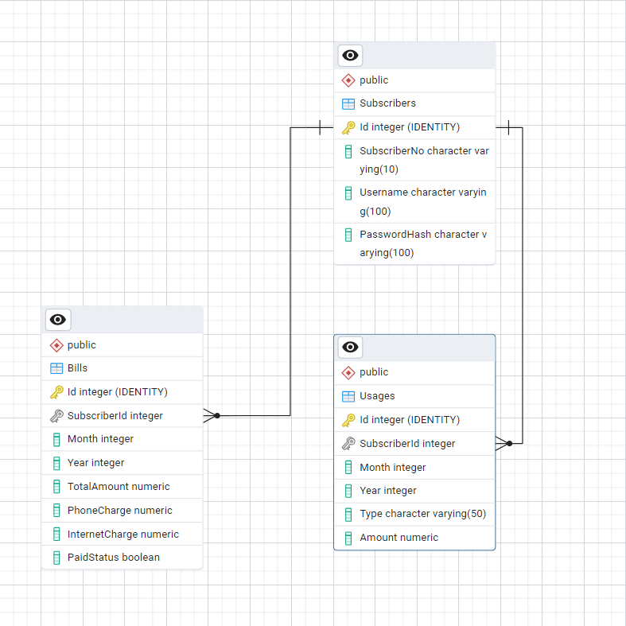

# Mobile Provider Billing System

A backend API for managing subscriber registrations, logging mobile and internet usage, calculating monthly bills, and processing payments for a mobile service provider. Built with ASP.NET Core and Entity Framework Core.

---

## 📦 Features

- **Authentication & Authorization** using JWT
- **Subscriber registration and login**
- **Logging usage** for phone and internet
- **Bill calculation** based on usage
- **Bill payment** with validation
- **Bill querying** with pagination and year filtering
- **Entity Framework Core** for database interactions

---

## 🚀 Getting Started
### Prerequisites

- [.NET 8 SDK](https://dotnet.microsoft.com/en-us/download/dotnet/8.0)
- [PostgreSQL](https://www.postgresql.org/download/)
- (Optional) [Postman](https://www.postman.com/) for API testing

### Installation

1. Clone the repository:

```bash
git clone https://github.com/bartutaskin/MobileProviderAPI.git
cd MobileProviderAPI
```

2. Create a PostgreSQL database and update the connection string in `appsettings.json`:
```json
{
  "ConnectionStrings": {
    "DefaultConnection": "YourConnectionStringHere"
  },
  "Jwt": {
    "Key": "YourSecretKey",
    "Issuer": "yourapp.com",
    "Audience": "yourapp.com"
  }
}
```

3. Run the migrations to set up the database:
```bash
dotnet ef database update
```

4. Run the application:
```bash
dotnet run
```

## 🖋️ API URL
The API can be accessed via the following URL:
- https://mobileproviderbt-egbra3excxgpfndy.italynorth-01.azurewebsites.net

## 🧪 Demo Access & Authentication

To test secured API endpoints, use the following demo account:

- **Username:** test 
- **Password:** test123

### 🔑 How to Authenticate

1. Call the login endpoint:
POST /api/v1/Auth/login
With body:
```json
{
  "username": "test",
  "password": "test123"
}
```
2. Copy the JWT token from the response.
3. Use it in the Authorize section (Swagger UI) like this:
``` 
Bearer <your-token-here>
```
✅ After authorizing, you can access all endpoints that require authentication.

## 📜 API Endpoints
### Authentication
- **POST** `/api/v1/Auth/register` - Register a new subscriber
- **POST** `/api/v1/Auth/login` - Login and get JWT token
### Usage
- **POST** `/api/v1/Usage/usage` - Add new usage data (Internet/Phone) (Auth required)
### Billing
- **POST** `/api/v1/Bill/calculate` - Calculates the bill for a subscriber (Auth required)
- **POST** `/api/v1/Bill/pay` - Pays a bill for a specific month/year
- **GET** `/api/v1/QueryBill/query` - Gets bill summary (Auth required)
- **GET** `/api/v1/QueryBillDetailed/query-detailed` - Gets bill details (Auth required)

## Design Decisions
- Modular Service Layer: Separated logic from controllers using services for better scalability and testability.

- DTO Usage: Used DTOs to decouple internal models from exposed endpoints.

- Custom Bill Calculation Logic:

  - Phone usage: free under 1000 mins, then 10 units per 1000 mins.

  - Internet: free under 20 GB, then 10 units per 10 GB.

- JWT-based Auth: Provides stateless security and supports authorized endpoints.

## 🧭 ER Diagram

Here is the Entity-Relationship (ER) diagram illustrating the core database structure of the system:


